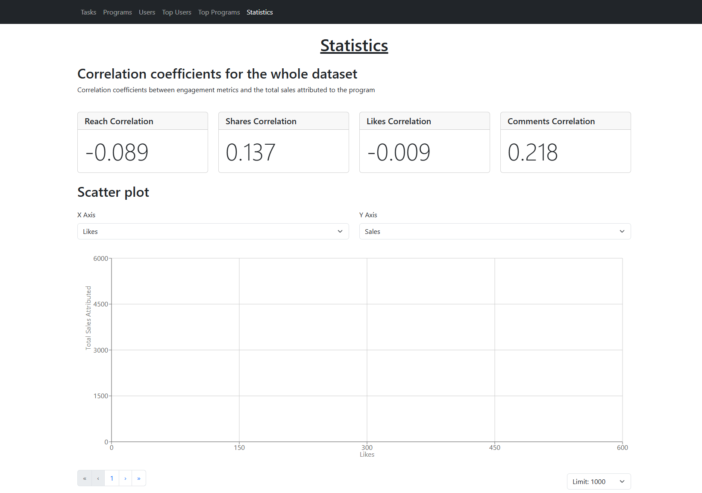
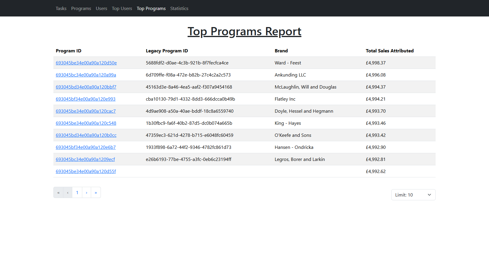
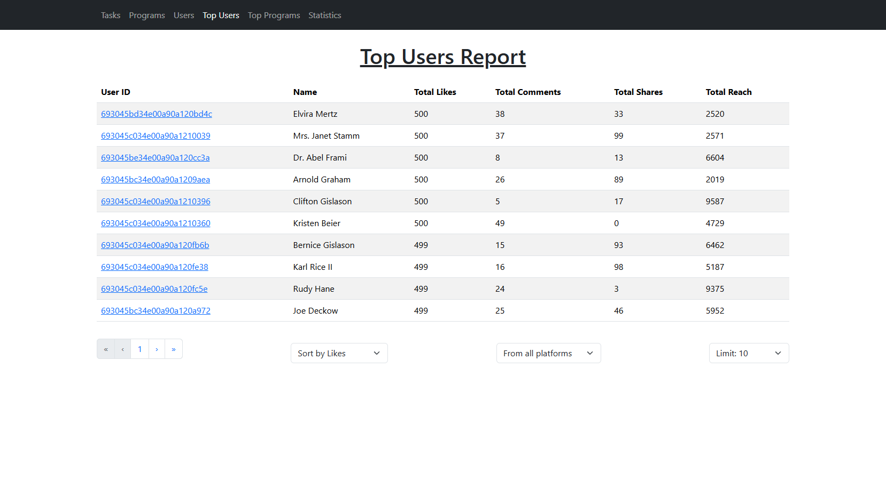
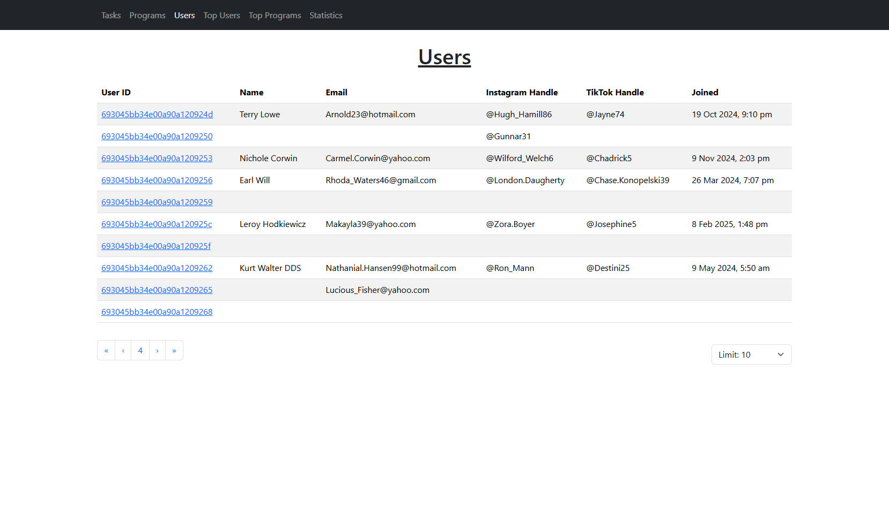
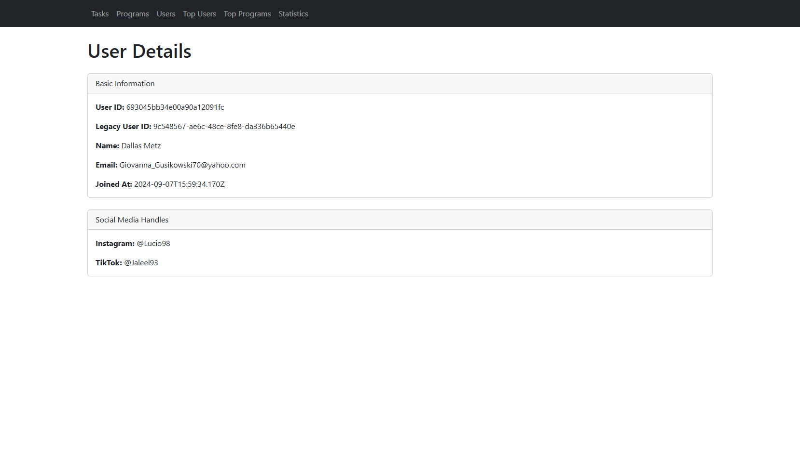
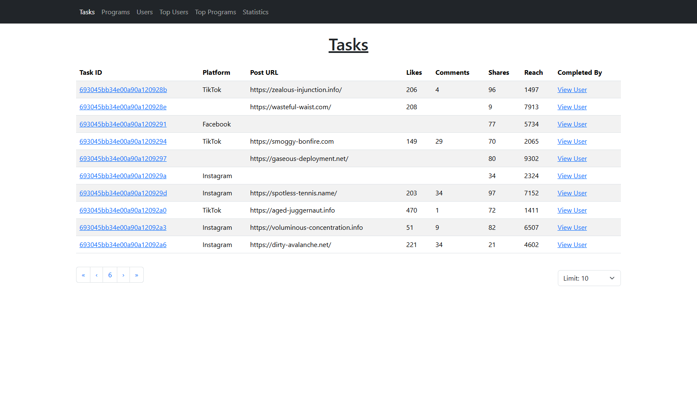
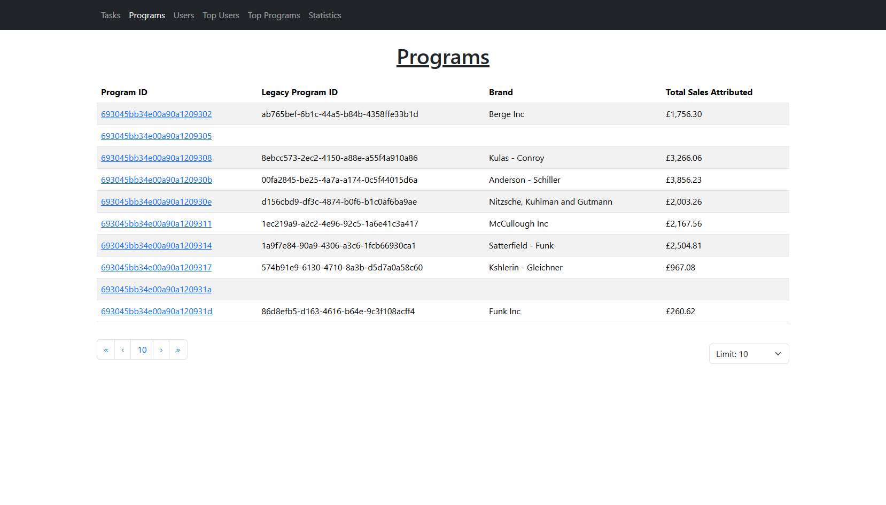
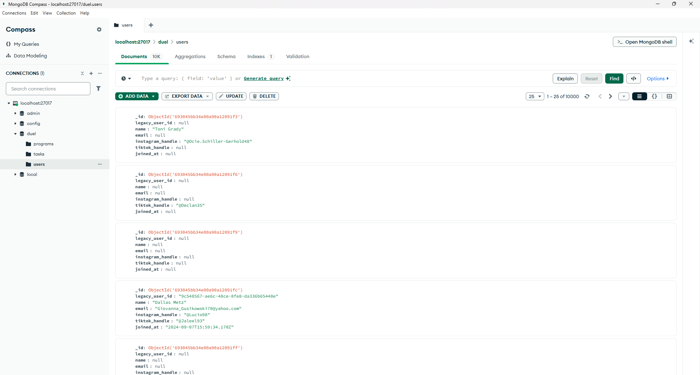

# Description

This repo contains:

1. A node script to sanitise and normalise the provided data and add it to a MongoDB database
2. An ExpressJs TypeScript backend to get the data
3. A React TypeScript frontend to view and analyse the data

The app contains the ability to:

- view groups or individual tasks, users and programs
- the users with the highest likes, comment, shares, and reach
- the programs with the highest total sales attributed
- the correlation coefficients between engagement metrics and the total sales attributed to the program
- a scatter plot of the completed tasks to look for trends and outliers

# How to run locally

### Step 1: Check you have recent Node and NPM versions

`node -v`

`npm -v`

I'm using v22.15.0 and v10.9.2, but it should work with any recent version.

### Step 2: Run MongoDB locally

Set the URL to `mongodb://localhost:27017/duel`

### Step 3: Add the ten thousand json files to the /initial_data folder

I didn't want to leak your data in a public git repository, so you have to add it manually.

### Step 4:

From the root:

Install the dependencies three times; in the root, client folder, and server folder.

```
npm install
```

Back in the root folder, run this script to clean and import the data into MongoDB

```
npm run import-data
```

Start the backend and frontend

```
npm start
```

### Step 5: View the app

[http://localhost:3000/](http://localhost:3000/)

(http://localhost:5000/tasks for the backend)

# Screenshots












# Insights about the data

- Some JSON files were missing closing brackets. I decided to automatically fix them.
- I was expecting a one-to-many relationship between the IDs but all the program_ids and user_ids are unique or null. I decided to use the IDs generated by MongoDB so that I could trust they existed and were unique. The original IDs might be useful for external systems or tracking and so I stored in them a "legacy_user_id" field in the database but I don't use them directly
- advocacy_programs always has a length of one but I'm writing code as if it can be any length
- I didn't detect any meaningful correlation between any of the task properties: likes, comments, shares, reach, or total sales. They appear to all be uniformly distributed.

# Deliberate omissions

- The project is only meant to run locally. Therefore I have left out:
  - Authentication and security
  - Using .env files. I have simply hardcoded localhost.
  - CORS
  - Rate limiting
- Comprehensive error handling and logging
- Supporting small screens
- Add CRUD for tasks, programs, and users
